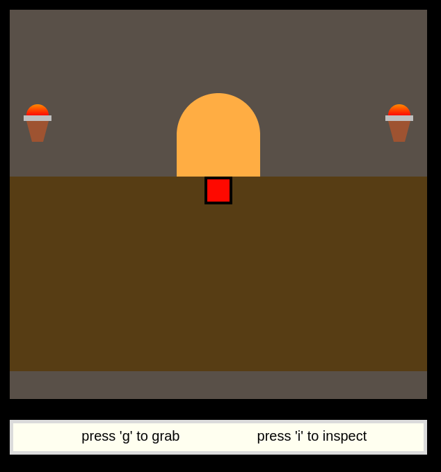

# Alice in Canvas Land

A web based puzzle game that requires physically exploring Carnegie Mellon's campus to crack the code. Levels designed in Google Sheets and animated with HTML Canvas. Hosted [here](https://flamboyant-brattain-40359c.netlify.com/). Unless you have time to visit the 1st floor of the Center of Fine Arts building, you probably won't be able to figure it out.

## Ideas for future iterations
* Use a build tool like brunch to allow writing js in modules. One massive file is not fun :(
* Instead of drawing all graphics in canvas, use a library that does sprites like pixi.js
* Obfuscate the javascript so that the final answer isn't in plain text in the source code.
